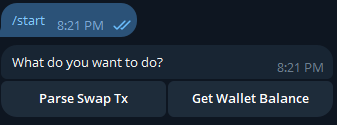
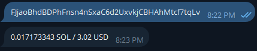
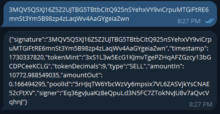

# Raydium Telegram bot

This Telegram bot retrieves the SOL balance of a specified wallet and provides detailed information about a transaction using its signature.

## Key Points / Requirements:

- ONLY SOLANA BLOCKCHAIN
- Only parse Raydium swap transactions, ignore all other. 
Also, ignore swaps without SOL being used as either IN or OUT token.
The output of parsed transaction should be of the following type:

```
export type TradeType = 'BUY' | 'SELL';

export interface Swap {
    // transaction signature
    signature: string;
    // ms since epoch when the transaction was processed
    timestamp: number;
    // mint of the alt token being traded
    tokenMint: string;
    // decimals of the alt token being traded
    tokenDecimals: number;
    // type of trade (BUY or SELL)
    type: TradeType;
    // UI amount of the input token, without decimals
    amountIn: number;
    // UI amount of the output token, without decimals
    amountOut: number;
    // raydium amm pool id which was used for the swap
    poolId: string;
    // address of the user who signed the transaction
    signer: string;
}
```

- Try to optimize it to only ONE rpc call per user input (applies both for parse tx and get balance), that’s important.
- You mustn’t use any third-party API’s for parsing swap transaction, only solana json rpc.
- Get balance should work only with System Program accounts. Use any API you’re most comfortable with for converting SOL balance to USD.
- Code should be as clean and understandable as possible. Try avoiding using any at all, unknown as much as possible.


## Tech Stack:
- NodeJs+TypeScript
- GrammyJs as a telegram bot api wrapper
- @solana/web3.js as a solana network json rpc wrapper
- Any other 3rd party package of your choice (but don’t overcomplicate things)


## How to run

### Install Dependencies
```
npm install
```

### Run Project
```
npm start
```

### Screenshots







### Contact me
If you need more technical support and development inquires, you can contact below.

Telegram: [@james_ybarra](https://t.me/@james_ybarra)

X: [@james980114](https://x.com/james980114)

Discord: [@Benix](https://discordapp.com/users/393598468653842432)

Thanks.
